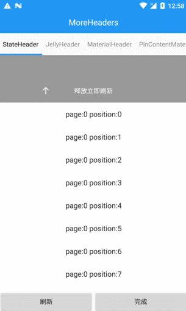

CoolRefreshView
===============  

###1. 支持任意View的刷新  
###2. 支持自定义Header
###3. 支持NestedScrollingParent,NestedScrollingChild的事件分发
###4. 嵌套ViewPager不会有事件冲突  

###7.导入方式
<1>gradle导入      

    compile 'com.shizhefei:CoolRefreshView:1.0.4'
    由于用到了v4和recyclerview所以也要导入他们  
    compile 'com.android.support:support-v4:23.4.0'  

<2>jar包方式导入  

Download sample [Apk](https://github.com/LuckyJayce/CoolRefreshView/blob/master/raw/CoolRefreshView.apk?raw=true)   

###8.历史版本和更新信息  
https://github.com/LuckyJayce/CoolRefreshView/releases

# 效果图 #

# 使用方法  
xml

     <com.shizhefei.view.coolrefreshview.CoolRefreshView
        android:layout_width="match_parent"
        android:layout_height="match_parent">

        <android.support.v7.widget.RecyclerView
            android:layout_width="match_parent"
            android:layout_height="match_parent"/>

    </com.shizhefei.view.coolrefreshview.CoolRefreshView>

代码

     coolRefreshView.setPullHeader(new MaterialHeader(getContext()));
     //添加刷新监听
     coolRefreshView.addOnPullListener(new SimpleOnPullListener() {
            @Override
            public void onRefreshing(CoolRefreshView refreshView) {
                
            }
        });

# 其它可用方法  

设置全局的IPullHeaderFactory

	  //静态设置全局的IPullHeaderFactory，一次配置，所有默认使用这个factory生成的PullHeader
	  //就不用每个界面设置，该代码可以放在Application onCreate

	  CoolRefreshView.setPullHeaderFactory(new IPullHeaderFactory() {
	      @Override
	      public PullHeader made(Context context) {
	          JellyHeader jellyHeader = new JellyHeader(getContext());
	          jellyHeader.setDragLayoutColor(ContextCompat.getColor(getContext(), R.color.primary));
	          jellyHeader.setLoadingView(R.layout.layout_jelley_header);
	          return jellyHeader;
	      }
	
	      @Override
	      public boolean isPinContent() {
	          return false;
	      }
	  });
设置ContentView是否和头部一起下拉

    /**
     * @param pullHeader   刷新的头部
     * @param isPinContent true滚定内容不下拉，只下拉头部， false 一起下拉
     */
    setPullHeader(PullHeader pullHeader, boolean isPinContent) 

# 自定义Header
##<1>简单的实现  
实现PullHeader

	public class TestHeader implements PullHeader {
	    private View headView;
	    private TextView mTextView;
	
	    @Override
	    public View createHeaderView(final CoolRefreshView refreshView) {
	        headView = LayoutInflater.from(refreshView.getContext()).inflate(R.layout.coolrecyclerview_testhead, refreshView, false);
	        mTextView = (TextView) headView.findViewById(R.id.coolrecyclerview_testhead_text1_textView);
	        return headView;
	    }
	
	    /**
	     * 开始拖动
	     */
	    @Override
	    public void onPullBegin(CoolRefreshView refreshView) {
	        isDownArrow = true;
	    }
	
	    /**
	     * 位置变化
	     *
	     * @param refreshView
	     * @param status          状态 /没有任何操作
	     *                        public final static byte PULL_STATUS_INIT = 1;
	     *                        //开始下拉
	     *                        public final static byte PULL_STATUS_TOUCH_MOVE = 2;
	     *                        //回到原始位置
	     *                        public final static byte PULL_STATUS_RESET = 3;
	     *                        //刷新中
	     *                        public final static byte PULL_STATUS_REFRESHING = 4;
	     *                        //刷新完成
	     *                        public final static byte PULL_STATUS_COMPLETE = 5;
	     * @param dy              下拉事件的位移
	     * @param currentDistance 当前位移的距离
	     */
	    @Override
	    public void onPositionChange(CoolRefreshView refreshView, int status, int dy, int currentDistance) {
	        int offsetToRefresh = getConfig().offsetToRefresh(refreshView, headView);
	        if (status == CoolRefreshView.PULL_STATUS_TOUCH_MOVE) {
	            if (currentDistance < offsetToRefresh) {
	                if (!isDownArrow) {
	                    mTextView.setText("下拉刷新");
	                    isDownArrow = true;
	                }
	            } else {
	                if (isDownArrow) {
	                    mTextView.setText("释放立即刷新");
	                    isDownArrow = false;
	                }
	            }
	        }
	    }
	
	    private boolean isDownArrow;
	
	    /**
	     * 刷新中
	     */
	    @Override
	    public void onRefreshing(CoolRefreshView refreshView) {
	        mTextView.setText("刷新中..");
	    }
	
	    /**
	     * 没有刷新的释放回去
	     */
	    @Override
	    public void onReset(CoolRefreshView refreshView, boolean pullRelease) {
	
	    }
	
	    /**
	     * 设置刷新完成，并且释放回去
	     */
	    @Override
	    public void onPullRefreshComplete(CoolRefreshView frame) {
	
	    }
	
	    @Override
	    public Config getConfig() {
	        return config;
	    }
	
		//使用默认的配置
	    private DefaultConfig config = new DefaultConfig();
	
	}

也可以直接继承View 实现 PullHeader

	public class TestHeader extends View  implements PullHeader {
	    @Override
	    public View createHeaderView(final CoolRefreshView refreshView) {
	        return this;
	    }
	}

##<2>配置距离，可以实现更丰富的效果

	 abstract class Config {
	        /**
	         * 超出这个偏移量，松开手指就会触发刷新。
	         */
	        public abstract int offsetToRefresh(CoolRefreshView refreshView, View headerView);
	
	        /**
	         * 显示刷新的位置的偏移量
	         */
	        public abstract int offsetToKeepHeaderWhileLoading(CoolRefreshView refreshView, View headerView);
	
	        /**
	         * 刷新控件总共可以下拉拖动的距离
	         */
	        public abstract int totalDistance(CoolRefreshView refreshView, View headerView);
	
	        /**
	         * headView 在布局中的偏移量
	         */
	        public abstract int headerViewLayoutOffset(CoolRefreshView refreshView, View headerView);
	
	        /**
	         * contentView 是否可以向上滚动，用来判断是否可以下拉刷新，如果可以向上滚动就不做下拉刷新动作
	         */
	        public abstract boolean contentCanScrollUp(CoolRefreshView refreshView, View contentView);
	
	        /**
	         * 拦截滑动事件
	         *
	         * @param refreshView
	         * @param dy              触摸滑动的偏移量
	         * @param currentDistance 当前的滑动的距离
	         * @param totalDistance   总的可下拉距离
	         * @return
	         */
	        public abstract int dispatchTouchMove(CoolRefreshView refreshView, int dy, int currentDistance, int totalDistance);
	
	    }

  **默认的配置**

    //滑动的总距离是header高度3倍
    //触发刷新的距离是header的1.2倍
    //正在刷新中的距离是header的高度
	class DefaultConfig extends Config {

        @Override
        public int offsetToRefresh(CoolRefreshView refreshView, View headerView) {
            return (int) (headerView.getMeasuredHeight() * 1.2f);
        }

        @Override
        public int offsetToKeepHeaderWhileLoading(CoolRefreshView refreshView, View headerView) {
            return headerView.getMeasuredHeight();
        }

        @Override
        public int totalDistance(CoolRefreshView refreshView, View headerView) {
            return headerView.getMeasuredHeight() * 3;
        }

		.....
    }

  **第二种常用的配置**

    //总的滑动是header的高度，也就是滑动显示的区域控制在header里
    //正在刷新的距离是header3分之一，在header底部的3分之一区域作为正在刷新中的区域
    //触发刷新的距离是正在刷新距离的1.2倍.

 	private DefaultConfig config = new DefaultConfig() {
        @Override
        public int offsetToRefresh(CoolRefreshView refreshView, View headerView) {
            return (int) (headerView.getMeasuredHeight() / 3 * 1.2f);
        }

        @Override
        public int offsetToKeepHeaderWhileLoading(CoolRefreshView refreshView, View headerView) {
            return headerView.getMeasuredHeight() / 3;
        }

        @Override
        public int totalDistance(CoolRefreshView refreshView, View headerView) {
            return headerView.getMeasuredHeight();
        }
    };

##配合MVCHelper类库使用，上滑加载更多
配合
https://github.com/LuckyJayce/MVCHelper   
代码只要5行，就可以实现下拉刷新，滚动底部自动加载更多，分页加载，自动切换显示网络失败布局，暂无数据布局

    CoolRefreshView coolRefreshView = (CoolRefreshView) findViewById(R.id.coolRefreshView);
    MVCHelper<List<Book>> mvcHelper = new MVCCoolHelper<List<Book>>(coolRefreshView);

    // 设置数据源
    mvcHelper.setDataSource(new BooksDataSource());
    // 设置适配器
    mvcHelper.setAdapter(new BooksAdapter(this));

    // 加载数据
    mvcHelper.refresh();

更多的详细使用参照 https://github.com/LuckyJayce/MVCHelper 的demo

## 说明

  滑动事件的处理是参照 v4包的 SwipeRefreshLayout，从而支持了支持NestedScrollingParent,NestedScrollingChild的事件分发和避免了嵌套 ViewPager事件冲突  

  结构是参考  https://github.com/liaohuqiu/android-Ultra-Pull-To-Refresh 的结构，它的结构很不错。可以让使用者根据需求自定义Header

  Header的下拉我采用了两种实现  
  <1>Header下拉，内容固定不下拉采用 ViewCompat.offsetTopAndBottom(mHeaderView, -deltaY);  
  <2>Header和内容一起下拉的采用 scrollTo的方式一起滑动.

  

##主力类库##

**1.https://github.com/LuckyJayce/ViewPagerIndicator**  
Indicator 取代 tabhost，实现网易顶部tab，新浪微博主页底部tab，引导页，无限轮播banner等效果，高度自定义tab和特效

**2.https://github.com/LuckyJayce/MVCHelper**  
实现下拉刷新，滚动底部自动加载更多，分页加载，自动切换显示网络失败布局，暂无数据布局，支持任意view，支持切换主流下拉刷新框架。

**3.https://github.com/LuckyJayce/MultiTypeView**  
简化RecyclerView的多种type的adapter，Fragment可以动态添加到RecyclerView上，实现复杂的界面分多个模块开发

**4.https://github.com/LuckyJayce/EventBus**  
事件总线，通过动态代理接口的形式发布,接收事件。定义一个接口把事件发给注册并实现接口的类

**5.https://github.com/LuckyJayce/LargeImage**  
大图加载，可供学习

**6.https://github.com/LuckyJayce/GuideHelper**  
新手引导页，轻松的实现对应的view上面的显示提示信息和展示功能给用户  

**7.https://github.com/LuckyJayce/HVScrollView**  
可以双向滚动的ScrollView，支持嵌套ScrollView联级滑动，支持设置支持的滚动方向

**8.https://github.com/LuckyJayce/CoolRefreshView**  
  下拉刷新RefreshView，支持任意View的刷新 ，支持自定义Header，支持NestedScrollingParent,NestedScrollingChild的事件分发，嵌套ViewPager不会有事件冲突 

有了这些类库，让你6的飞起

## 说明 ##
项目 ViewPagerIndicator_Demo 是示例代码。 看了这个例子你会惊奇的发现里面居然都是通过viewpager实现，没有使用tabhost，而所有形式的tab都是用Indicator实现。
项目 ViewPagerIndicator_Library 是类库

有什么建议可以发到我的邮箱  794629068@qq.com  

# 联系方式和问题建议

* 微博:http://weibo.com/u/3181073384
* QQ 群: 开源项目使用交流，问题解答: 549284336

License
=======

	/*
	 * Copyright (C) 2016 LuckyJayce
	 * Copyright (C) 2016 liaohuqiu
	 * Copyright (C) 2013 The Android Open Source Project
	 *
	 * Licensed under the Apache License, Version 2.0 (the "License");
	 * you may not use this file except in compliance with the License.
	 * You may obtain a copy of the License at
	 *
	 *      http://www.apache.org/licenses/LICENSE-2.0
	 *
	 * Unless required by applicable law or agreed to in writing, software
	 * distributed under the License is distributed on an "AS IS" BASIS,
	 * WITHOUT WARRANTIES OR CONDITIONS OF ANY KIND, either express or implied.
	 * See the License for the specific language governing permissions and
	 * limitations under the License.
	 */
